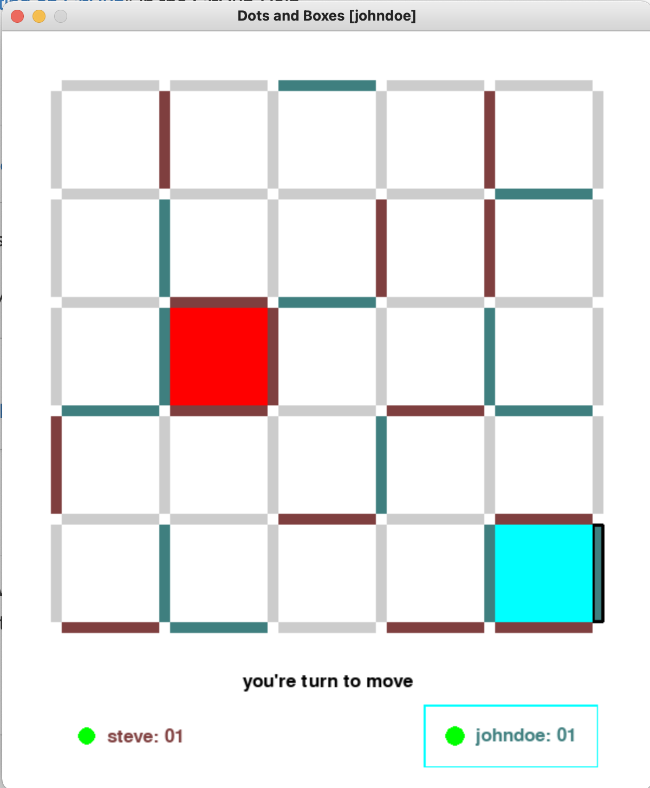

# Dots and Boxes

Refer [Wikipedia](https://en.wikipedia.org/wiki/Dots_and_Boxes) for more details about the game.



## Setup

Requires python 3.7 or above.


### Client

Install project dependencies using
    
    pip3 install -r requirements.txt
    

To connect to server run 

    python3 client.py --username <username> --password <password> --uri <server-uri> --signup
    
Username and Password must have lengths between 4 and 9 and can contain only alpha-numeric characters.

Use ```--signup``` flag while running the command first time. Its not needed subsequent times.

In case SSL Certificate Verification error, pass ```--insecure``` flag while running the client. 

NOTE:  Game has an IDLE_TIMEOUT of 5 minutes (game expires if no move is made in that time)
and Game has a MAX_TIMEOUT of 15 minutes (game can last at max 15 min), as defined in ```server.py```.